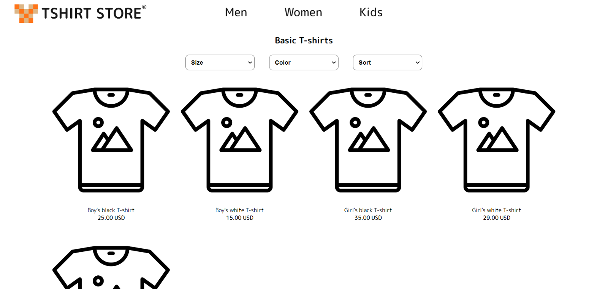

# CSS layout practice of e-commerce website
### About
This is a simple project to practice the CSS layout of a e-commerce website.
### Diagram

### Features
* **RWD design**: In 600px and 960px breakpoints,  have different style than the mobile viewpoint.
* **Simple interaction**: When you hover the commodity's card, the photo will emerge.
### How to view the website?
You can see this project on:
**https://chungyingho.github.io/E-commerce-Layout/**
