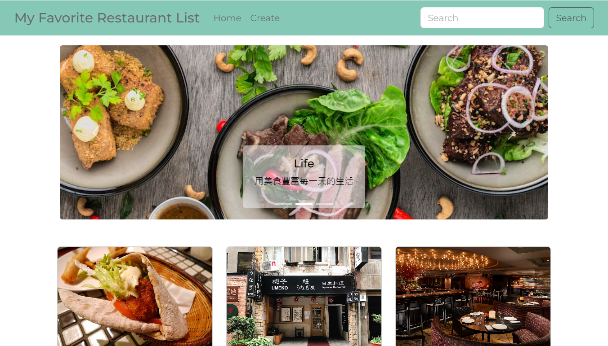
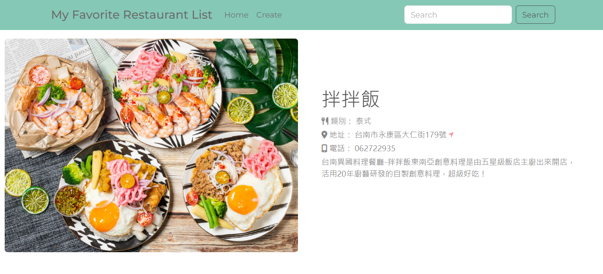

# **My Favorite Restaurant List**
## **介紹 (About)**
還在為每次吃飯時都要想要吃什麼感到困擾嗎？把大家推薦的美食都記錄下來吧！這就是一個這樣讓你記錄美食的網站。
## **專案示意圖 (Diagram)**


## **功能列表 (Features)**
* 點擊首頁的餐廳卡片可以顯示出該餐廳的細節。
* 點擊 **Create** 按鈕可建立新的餐廳卡片。
* 點擊 **Edit** 和 **Delete** 按鈕可以編輯或刪除餐廳資料。
* 在搜尋欄中輸入關鍵字可以找出餐廳名字或種類符合關鍵字的餐廳資訊。
## **專案安裝 (Installation)**
1. 請先確認是否已有安裝 node.js 與 npm。
2. 打開 Terminal 複製此專案到本機電腦
```
git clone https://github.com/ChungYingHo/Restaurant-List.git
```
3. 在 Terminal 中前往此專案資料夾
```
cd Restaurant-List
```
4. 安裝 npm 套件
```
npm install
```
5. 安裝 nodemon
```
npm install nodemon
```
6. 在專案路徑下新增 **.env** 檔案，輸入你自己的 MongoDB 的連線字串。
```
MONGODB_URI = "<你的連線字串>"
```
7. 開啟程式
```
npm run dev
```
8. 當Terminal顯示 `The app is running on http://localhost:3000` 以及 `mongoDB connected.` 時表示程式開啟成功。
9. 打開瀏覽器，前往 http://localhost:3000 以檢視專案成果。
## **環境建置與開發工具 (Prerequisites)**
1. **node.js** / 14.16.0
2. **express** / 4.17.1
3. **mongoose** / 5.9.7
4. **express-handlebars** / 5.3.3
5. **body-parser** / 1.20.2
6. **dotenv** / 16.3.1
7. **method-override** / 3.0.0