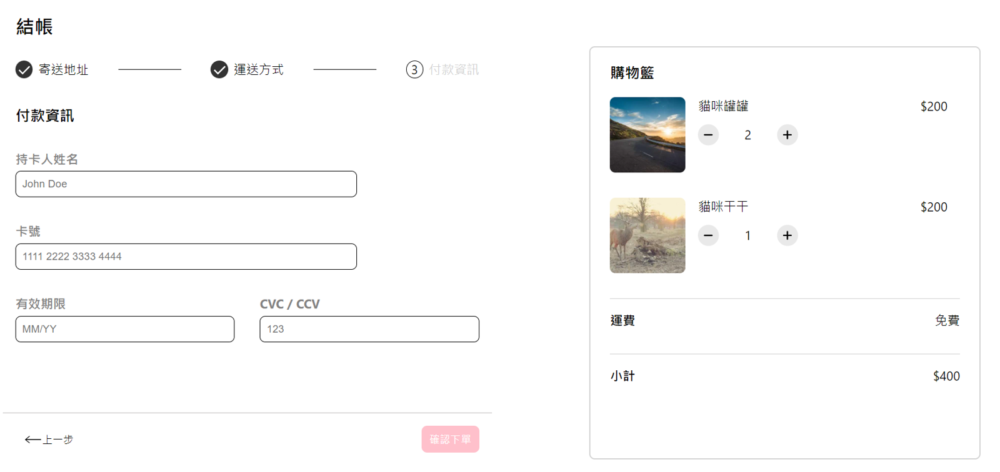

# ALPHA Shop
這是一個模擬電商購物車結帳頁面的 React 專案。您可以在下列網址瀏覽專案成品展示：**https://chungyingho.github.io/ALPHA-shop/**
### 專案示意圖 (Diagram)

### 功能列表 (Features)
這個結帳頁面可以分成兩個主要部分：**客戶結帳資訊**與**購物車內容**。
* 客戶結帳資訊：又可拆分成三個表單頁面，點擊**下一步**按鈕都會及時渲染下一個表單，並且上方的進度條會跟著變換樣式提醒用戶正在填寫的進度。
* 購物車內容：購物車可以讓用戶在結帳時仍可以隨意更改商品數量，網頁會根據商品數量變化即時更新商品總價。
* 在第三個結帳頁面點擊**確認下單**後會有彈出視窗跳出顯示用戶於第三頁填入的付款資訊與最後總價。
### 專案開啟 (Installation)
1. 複製專案
```
git clone https://github.com/ChungYingHo/ALPHA-shop.git
```
2. 進入專案路徑
```
cd ALPHA-shop
```
3. 安裝套件
```
npm install
```
4. 啟動專案
```
npm start
```
5. 前往 **http://localhost:3000** 查看網頁
### 環境建置與開發工具 (Prerequisites)
1. **react** / 18.2.0