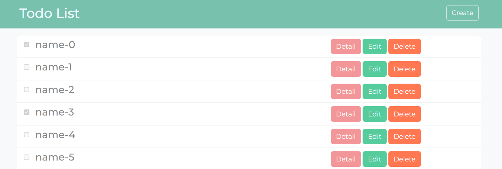

# **Todo List (Express & Bootstrap version)**
## **介紹 (About)**
這是一個簡易的代辦事項清單網頁，可以幫助管理日常生活中的大小瑣事。
## **專案示意圖 (Diagram)**

## **功能列表 (Features)**
* 新增代辦事項
* 瀏覽代辦事項詳細資訊
* 編輯代辦事項
* 刪除代辦事項
* 勾選以註明完成代辦事項
## **專案安裝 (Installation)**
1. 請先確認是否已有安裝 node.js 與 npm。
2. 打開 Terminal 複製此專案到本機電腦
```
git clone https://github.com/ChungYingHo/Todo-List-v1.0.git
```
3. 在 Terminal 中前往此專案資料夾
```
cd Todo-List-v1.0
```
4. 安裝 npm 套件
```
npm install
```
5. 安裝 nodemon
```
npm install nodemon
```
6. 在專案路徑下新增 **.env** 檔案，輸入你自己的 MongoDB 的連線字串。
```
MONGODB_URI = "<你的連線字串>"
```
7. 開啟程式
```
npm run dev
```
8. 當Terminal顯示 `Express is running on http://localhost:3000` 以及 `mongoDB connected!` 時表示程式開啟成功。
9. 打開瀏覽器，前往 http://localhost:3000 以檢視專案成果。
## **環境建置與開發工具 (Prerequisites)**
1. **node.js** / 14.16.0
2. **express** / 4.17.1
3. **mongoose** / 5.9.7
4. **express-handlebars** / 5.3.3
5. **body-parser** / 1.20.2
6. **dotenv** / 16.3.1
7. **method-override** / 3.0.0