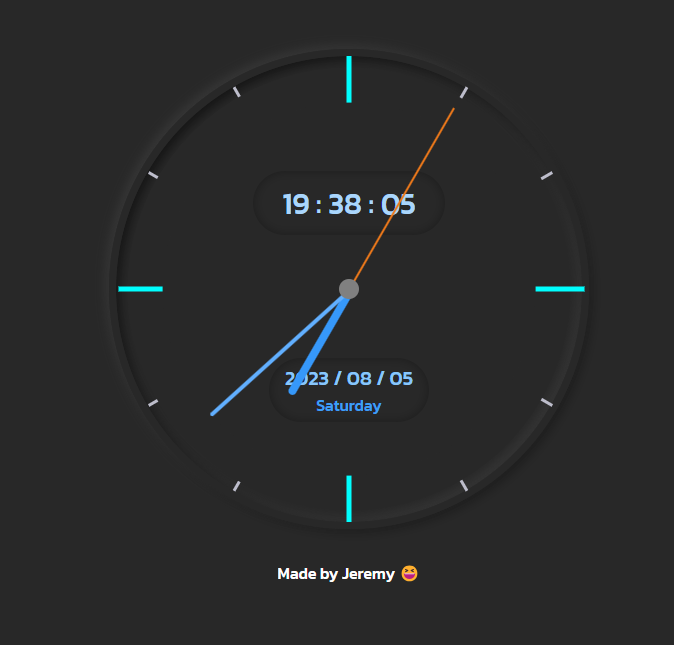

# Analog Clock
It is a simple analog clock created by HTML, CSS and JavaScript. The styles are referenced from this [website](https://dev.to/code_mystery/simple-analog-clock-using-html-css-javascript-2c6a).
### Diagram

### How to view the website?
You can browse this website at the following URL: **https://chungyingho.github.io/Analog-Clock/**
